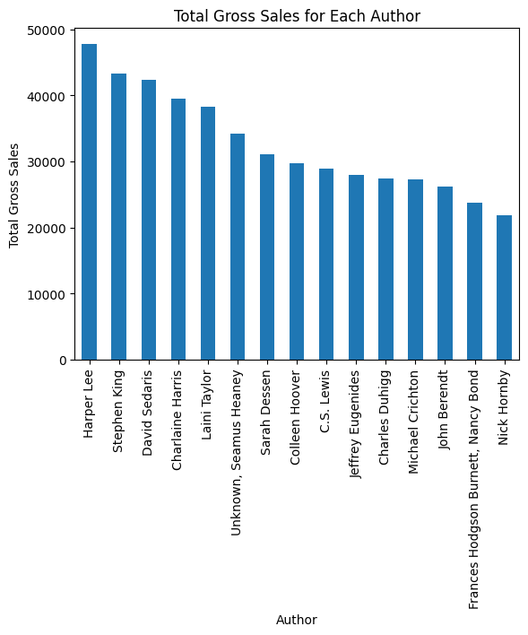
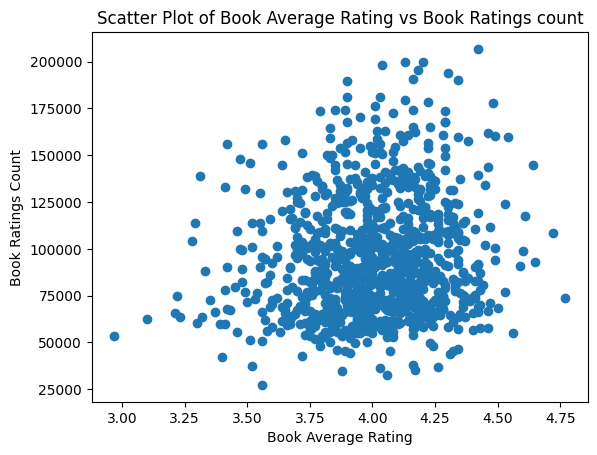
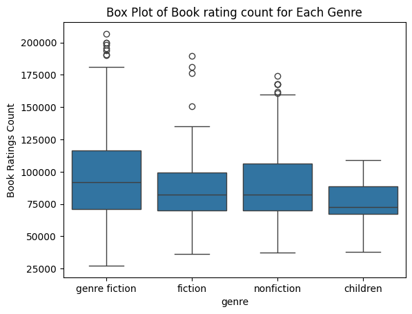

# Book Sales Data Analysis

## Overview
This project focuses on exploratory data analysis (EDA) of book sales data to understand
sales patterns across authors, individual books, genres, and pricing-related factors.

The analysis emphasizes **visual exploration** using charts and summary statistics to
identify trends, distributions, and relationships in the data.

---

## Project Objective
- Analyze book sales trends over time
- Compare sales performance across authors and books
- Examine relationships between ratings, popularity, and sales
- Use visualizations to clearly communicate insights

---

## Dataset
The dataset contains information related to book sales, including:
- Book titles
- Author names
- Genres
- Sales figures
- Book ratings and rating counts
- Publishing year

---

## Exploratory Data Analysis & Visual Insights

### 1. Total Units Sold Over Time
This line chart shows how total book sales have evolved across publishing years.

**Insight:**  
Book sales increase significantly in more recent years, indicating growth in publishing
volume and/or reader demand over time.

---

### 2. Total Gross Sales by Author
This bar chart compares total gross sales across different authors.

**Insight:**  
A small number of authors account for a large share of total sales, suggesting strong
author-driven demand and popularity effects.

---

### 3. Book Rating vs Rating Count
This scatter plot examines the relationship between average book ratings and the number
of ratings received.

**Insight:**  
Higher ratings do not necessarily correspond to higher engagement. Popularity (rating
count) varies widely even among similarly rated books.

---

### 4. Distribution of Ratings Count by Genre
This boxplot compares the distribution of rating counts across genres.

**Insight:**  
Genres such as fiction and nonfiction show higher variability and more extreme outliers,
while children's books tend to have more consistent engagement levels.

---

## Key Takeaways
- Sales and engagement are unevenly distributed across authors and genres
- Time trends indicate increasing sales activity in recent years
- Ratings alone do not explain popularity or sales performance
- Visual analysis is essential for uncovering patterns not visible in raw data

---

## Tools & Technologies
- Python
- Pandas
- Matplotlib
- Seaborn
- Jupyter Notebook
- Microsoft Excel (initial data inspection)

---

## Project Files
- `Book Sales Data Analysis.ipynb` – Data cleaning, EDA, and visualizations
- `images/` – Screenshots of charts used in analysis
- Dataset file(s)

---

## Notes
This repository focuses on **data analysis and visualization**, not predictive modeling.
The goal is to demonstrate analytical thinking and the ability to interpret and communicate
data-driven insights using effective visualizations.
